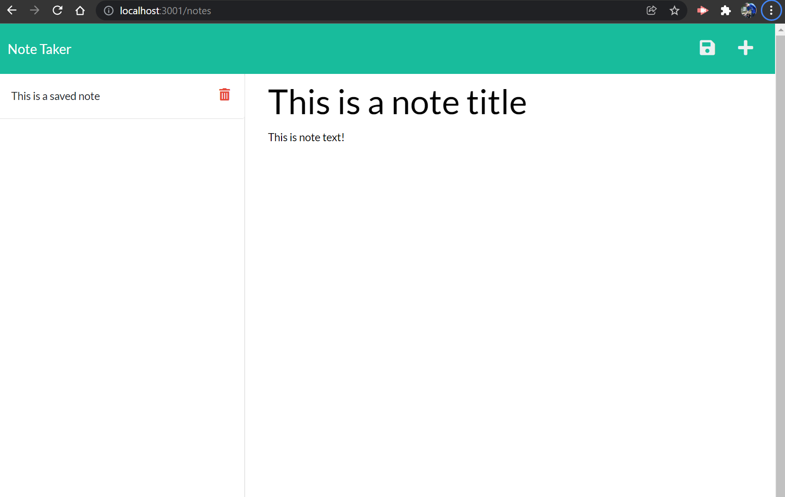

# **Note Taker** 

## Synopsis

* Save notes!
* Saves user text area input to the database for later retrieval
* Delete notes! 
* Has it's own server! 

**See it Live:** 

<!-- https://jddlwlr.github.io/workday_schedule_utility/ -->

## Usage

This application is to be used to save notes. 
 

### Features

* Express.js server
* Clean layout/ UI
* Database containing all notes
* Live deployment through Heroku
 
 

## Code

This application utilizes Express.js for the server, FS for file edits.  

### Limitations

This application literally has no limits, you can note anything you could possibly imagine. Mom's spaghetti recipe? check. Your favorite links? check. Your memior? check.

## With Thanks to

Google, my discord classmates, and the ever popular MDN. 

## License

Copywritten by me Jesse Lawler (2022)

## About Jesse Lawler

Jesse Lawler is a Geologist turned aspiring web developer currently enrolled in the Georgia institure of Technologies online full-stack web development course. Jesse like fishing, skiing and _long_ walks on the beach. 
